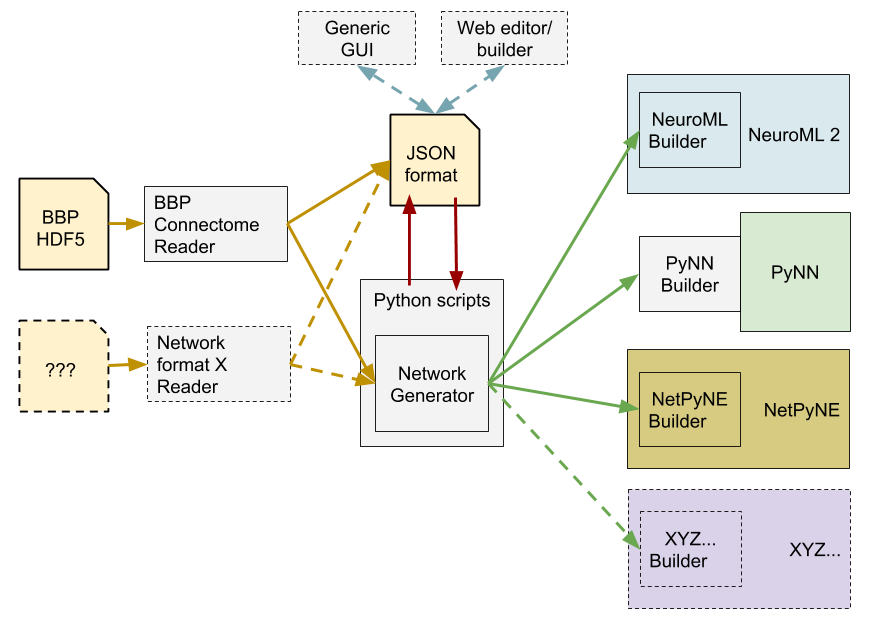

### Proposal for common framework for reading/writing/generating network specifications

The best way to see the currently proposed structure is to look at the examples

#### Ex. 1: Simple network, 2 populations & projection
[JSON](Example1_TestNetwork.json) | [Python script](Example1.py)

#### Ex. 2: Simple network, 2 populations, projection & inputs
[JSON](Example2_TestNetwork.json) | [Python script](Example2.py) | [Generated NeuroML2](Example2_TestNetwork.net.nml)

#### Ex. 3: As above, with simulation specification
[JSON for network](Example3_TestNetwork.json) | [JSON for simulation](SimExample3.json) | [Python script](Example3.py) | [Generated NeuroML2](Example3_Network.net.nml) | [Generated LEMS](LEMS_SimExample3.xml)
